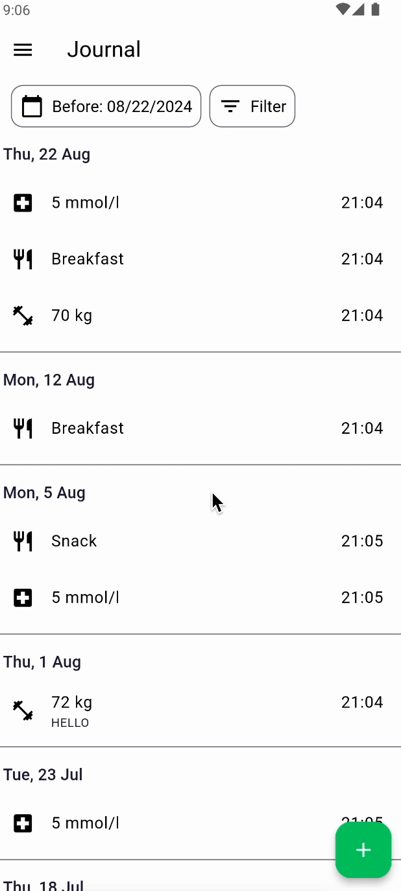
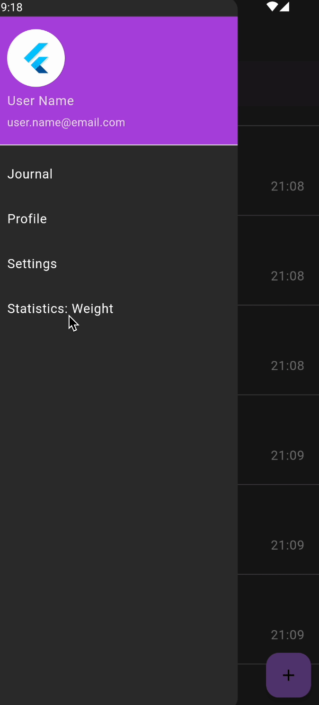
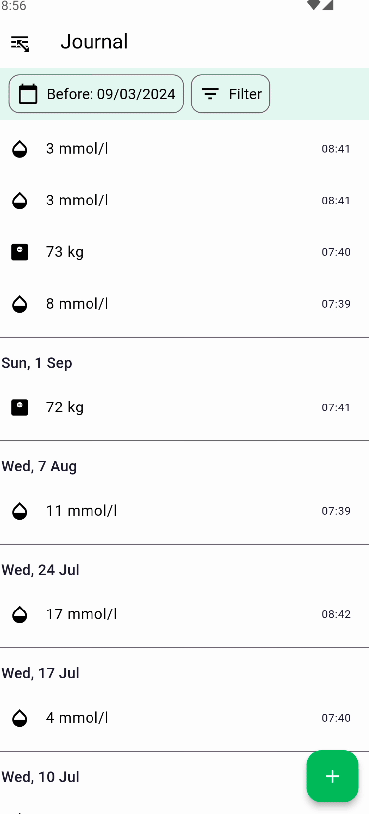

# Health Track

Track your weight, blood sugar and meals.

### Journal



### Weight Statistics



### Blood Sugar Statistics



## Dependencies

Can be updated in pubspec.yaml

Check installed:

```
flutter pub deps
```

Install dependencies:

```
flutter pub get
```

Check outdated:

```
flutter pub outdated
```

Upgrades:

```
flutter pub upgrade --major-versions
```

## Drift

You will get an analyzer warning on the `part` statement and on `extends _$AppDatabase`. This is expected because drift's generator did not run yet. You can do that by invoking [build_runner](https://pub.dev/packages/build_runner):

```
dart run build_runner build
```

generates all the required code once.

```
dart run build_runner watch
```

watches for changes in your sources and generates code with incremental rebuilds. This is suitable for development sessions.

Database path: '[/data/user/0/com.example.healthtrack1/app_flutter/journal_database.sqlite]()'

## Line Length

Increase line length from 80 to 120 in Code - Preferences - Settings - search by "length" and update Dart: Line Length value.


